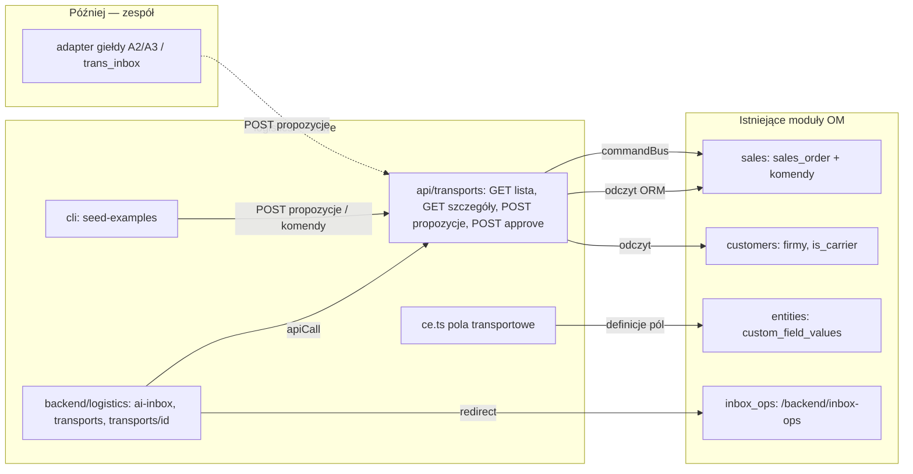

# Panel spedytora — szkielet (menu, tabela przewozów, szczegóły Order 1 / Order 2)

## 📝 TLDR

**Key Points:**
- Spedytor dostaje jeden ekran przewozów: tabelę z szybkimi decyzjami i szczegóły przewozu jako parę zamówień — **Order 1** (klient → nasza firma) i **Order 2** (nasza firma → przewoźnik z giełdy) plus **Order 3+** (dodatkowe ładunki z giełdy). To zachowanie przyszłe; dziś moduł `logistics` ma 7 osobnych stron bez tego widoku.
- Zero własnych tabel i migracji: każde zamówienie to `sales_order` z polami dodatkowymi z `ce.ts`; decyzje spedytora to zmiana statusu zamówienia komendą `sales.orders.update`.
- Moduł `logistics` zostaje nadpisany w miejscu (te same ścieżki). Faza 0 (wymiana stron) może iść osobnym, małym PR-em, żeby odblokować decyzję o PR #9; Fazy 1–2 to jedna zdolność i idą razem.

**Scope:**
- Grupa menu „Nasza firma” z dwiema pozycjami: „AI Inbox / Offers” (przekierowanie do wbudowanego `inbox_ops`) i „AI Przewozy”.
- Tabela przewozów (`DataTable`) z akcjami „zatwierdź przewoźnika” / „zatwierdź dodatkowy załadunek”.
- Ekran szczegółów przewozu: sekcje Order 1, Order 2 (auto, ładowność, koszt, status), dodatkowe ładunki, wolne miejsce.
- Endpointy odczytu i akcji, przez które giełda (agent A2/A3 zespołu) i seed tworzą propozycje.
- Dane demo (seed) z propozycjami przewoźnika i dodatkowego ładunku.

**Concerns:**
- Kasacja stron Etapu 1 i konflikt z otwartym PR #9 (zamówienia w pamięci na stronie `transport-jobs`) — patrz Risks.
- Brak tabeli aut z ładownością: Dominik dostarcza; seed startuje z wartościami zastępczymi.
- Potrzeba spedytora to przekonanie zespołu (brief A01), nie obserwacja — projektujemy pod demo.

Źródło decyzji produktowych: [`product-brief.md`](product-brief.md) (R01–R04, N01–N02, D01–D04, Q01–Q02).

## Overview

Aplikacja `open-logistic` (fork Open Mercato) ma być panelem dyspozytorskim firmy spedycyjnej na demo HackOn Wrocław 2026. Ten spec opisuje **szkielet**, w który reszta zespołu wpina automaty: A1 (wycena z maila, przez `inbox_ops`), A2 (szukanie przewoźnika na giełdzie), A3 (dodatkowy załadunek w trasie). Szkielet działa bez nich na danych z seedu.

> **Market Reference**: otwarte TMS-y (np. Odoo Fleet/Freight, OpenTMS) modelują zlecenie klienta i zlecenie u podwykonawcy jako dwa dokumenty powiązane referencją, ze statusem zatwierdzenia na dokumencie podwykonawcy — to przyjmujemy (Order 1 / Order 2 jako dwa `sales_order`). Odrzucamy ich osobną encję „Trip/Tour” z harmonogramem i pojazdem flotowym: na demo nie mamy floty własnej (N01), a przewóz = Order 1.

## Problem Statement

Z briefu (Problems): przewóz ma dwie strony, a decyzje o przewoźniku i dodatkowym załadunku wymagają człowieka (R02). Obecne strony modułu `logistics` na `develop` to 7 zaślepek „Funkcja planowana”; na gałęzi `feat/logistics-data-foundation` i w PR #9 są dwa niezgodne prototypy (zamówienia jako `sales_order` + pola vs zamówienia w pamięci). Żaden nie pokazuje pary Order 1 / Order 2 ani szybkich decyzji.

## Proposed Solution

Przewóz jest **widokiem** nad zamówieniami sprzedaży, nie encją:

- **Order 1** = `sales_order` z `transport_role = client`. Tabela listuje wyłącznie takie zamówienia (R01).
- **Order 2** = `sales_order` z `transport_role = carrier`, `transport_parent_id = <Order 1>`, klientem na zamówieniu jest firma-przewoźnik (`customer_company_profile.is_carrier`). Niesie auto i ładowność (R04). Status `pending_approval` → `approved` | `rejected` ze słownika `sales.order_status`.
- **Order 3+** = `sales_order` z `transport_role = additional_load`, ten sam `transport_parent_id`. Tyle, ile mieści się w wolnym miejscu.
- **Wolne miejsce** liczone w locie: ładowność auta z Order 2 minus towar z Order 1 minus zatwierdzone dodatkowe ładunki; osobno palety i kilogramy, UI pokazuje bardziej ograniczającą jednostkę.
- Propozycje (Order 2, Order 3+) powstają przez endpointy akcji modułu, z których korzysta seed dziś i adapter giełdy zespołu jutro. Zatwierdzenie to `sales.orders.update` ze zmianą statusu.

### Design Decisions

| Decision | Rationale |
|---|---|
| Order 2 i Order 3+ jako osobne `sales_order` | Decyzja D02 briefu; jeden mechanizm dla przewoźnika i dodatkowych ładunków; widać je w standardowej liście zamówień OM |
| Status zatwierdzenia = natywny status zamówienia (`pending_approval`/`approved`/`rejected`) | Słownik już ma te wartości (`packages/core/src/modules/sales/lib/dictionaries.ts`); komenda `sales.orders.update` jest workflow-safe, ma snapshot i undo |
| Powiązanie polem `transport_parent_id` (uuid w polu tekstowym) | `sales_order` nie ma pola nadrzędnego; reguła repo „FK po id, bez relacji ORM między modułami”; zero migracji (R03, N02) |
| Odczyt pól z `custom_field_values` przez ORM, nie z indeksu zapytań | Świeżo zasiane wartości są widoczne od razu, bez workerów indeksu (wzorzec z `5bfe0388:lib/jobs.ts`) |
| Nadpisanie modułu `logistics` w miejscu | Odpowiedź Julii (Q1 szkieletu); menu na demo ma mieć 2 pozycje |
| Wolne miejsce liczone tylko z zatwierdzonych dodatkowych ładunków | Propozycja nie zajmuje miejsca, dopóki człowiek jej nie zatwierdzi (R02); przy zatwierdzaniu sprawdzamy ponownie |

### Alternatives Considered

| Alternative | Why Rejected |
|---|---|
| Pola przewoźnika na Order 1 | Odrzucone w briefie (D02) — nie da się mieć kilku propozycji ani listy dodatkowych ładunków |
| Własne pole `carrier_approval` zamiast statusu OM | Dubluje słownik statusów; decyzja niewidoczna w reszcie OM |
| Zamówienia w pamięci (PR #9 `lib/orders-store.ts`) | Znika po restarcie, nie ma tenanta ani historii; sprzeczne z N02 i R03 |
| Osobny moduł `dispatch` obok `logistics` | Odrzucone przez Julię (Q1) |

## User Stories / Use Cases

- **Spedytor** chce widzieć wszystkie przewozy z ich stanem (bez przewoźnika / propozycja / zatwierdzony), żeby wiedzieć, gdzie czeka decyzja.
- **Spedytor** chce zatwierdzić przewoźnika jednym kliknięciem z tabeli lub ze szczegółów, żeby automat mógł wysłać zlecenie dalej (R02).
- **Spedytor** chce widzieć, ile miejsca zostało w aucie, żeby zatwierdzić tylko taki dodatkowy ładunek, który się zmieści (R04).
- **Agent giełdy (A2/A3, później)** chce zgłosić propozycję przewoźnika lub ładunku do istniejącego przewozu, żeby spedytor ją zobaczył.

## Architecture

Moduł-nakładka `apps/mercato/src/modules/logistics/` (id `logistics`, bez zmian w `packages/*`).



Wniosek: `logistics` nie trzyma danych. Jedyny zapis to komendy modułu `sales`; jedyne wejście dla automatów to endpointy propozycji. Adapter giełdy jest **opcjonalnym peerem** — bez niego seed daje te same rekordy.

### Commands & Events

- Używane komendy (istniejące, moduł `sales`): `sales.orders.create` (propozycje), `sales.orders.update` (zmiana statusu). Undo: mechanizm komend `sales` (snapshot w `prepare`).
- Własne komendy: brak. Własne zdarzenia: brak w tym specu; zdarzenia `sales.order.updated` z core wystarczą, by A2/A3 zareagowały na zatwierdzenie (późniejsze subskrypcje zespołu).

## Data Models

Brak nowych tabel. Pola dodatkowe (`ce.ts`, `cf.*` z `@open-mercato/shared/modules/dsl`), wszystkie na `E.sales.sales_order`:

| Pole | Typ | Na roli | Znaczenie |
|---|---|---|---|
| `transport_role` | select `client` / `carrier` / `additional_load` | wszystkie | Order 1 / Order 2 / Order 3+ |
| `transport_parent_id` | text (uuid) | carrier, additional_load | id Order 1; wymagane (R01) |
| `pickup_address`, `delivery_address` | text | client, additional_load | miasto/adres załadunku i rozładunku |
| `pickup_window_start`, `pickup_window_end` | datetime | client, additional_load | okno odbioru |
| `cargo_pallets`, `cargo_weight_kg` | integer | client, additional_load | wielkość towaru |
| `client_price` | float | client, additional_load | cena dla klienta (PLN) |
| `max_carrier_cost` | float | client | limit kosztu przewoźnika |
| `vehicle_type` | text | carrier | np. „naczepa”, „solówka” (słownik Dominika) |
| `vehicle_capacity_pallets`, `vehicle_capacity_kg` | integer | carrier | ładowność auta (R04) |
| `vehicle_plate` | text | carrier | rejestracja (opcjonalnie) |
| `carrier_cost` | float | carrier | koszt przewoźnika (PLN) |
| `exchange_source` | select `seed` / `manual` / `trans` / `timocom` | carrier, additional_load | skąd propozycja |
| `exchange_ref` | text | carrier, additional_load | id oferty na giełdzie |
| `dispatch_note` | multiline | wszystkie | uzasadnienie automatu lub spedytora |

Pola na encji innego modułu (`E.customers.customer_company_profile`) z `ce.ts` modułu aplikacyjnego: wzorzec sprawdzony lokalnie na gałęzi `feat/logistics-data-foundation` (commit `5bfe0388`, `yarn generate` + widok przewoźników działały 2026-09-19); w Fazie 0 potwierdzić ponownie po `yarn generate`.

Na `E.customers.customer_company_profile`: `is_carrier` (boolean), `carrier_rating` (integer 1–5). Pola floty (`resources`, `staff`) z `5bfe0388` **nie wracają** (N01).

Tożsamość i zakres: każde zamówienie ma `tenant_id`, `organization_id`, `customer_entity_id`, `status`, `status_entry_id`, `updated_at` z core. Statusy: Order 1 `confirmed` (seed) lub dowolny; Order 2 / Order 3+ wyłącznie `pending_approval` → `approved` | `rejected`. **Komendy `sales.orders.create` / `sales.orders.update` przyjmują `statusEntryId` (uuid wpisu słownika), nie tekst** — moduł rozwiązuje wartość przez `resolveStatusEntryIdByValue(em, { tenantId, organizationId, value })` z `packages/core/src/modules/sales/lib/statusHelpers.ts`; brak wpisu (słownik jest edytowalny per tenant) → 500 `status_entry_missing` z logiem i `reportError`.

Aktywne Order 2 = to w statusie `pending_approval` lub `approved`; `rejected` trafia do historii. Na przewóz przypada najwyżej jedno aktywne Order 2.

Dane wrażliwe: adresy to lokalizacje firm (magazyny), nie osób; nazwy firm żyją w `customers` i są tam już szyfrowane (`findWithDecryption`). Nowe pola nie zawierają danych osobowych — brak wpisów w `encryption.ts` (N/A z uzasadnieniem).

### Model widoku (odpowiedzi API)

```ts
type TransportRow = {
  id: string; orderNumber: string; customerName: string;
  pickupAddress: string | null; deliveryAddress: string | null; pickupWindowStart: string | null;
  cargoPallets: number | null; cargoWeightKg: number | null; clientPrice: number | null;
  carrier: { orderId: string; name: string; status: 'pending_approval' | 'approved'; cost: number | null; vehicleType: string | null; updatedAt: string } | null; // tylko aktywne Order 2
  additionalLoads: { pending: number; approved: number; pendingOrderId: string | null; pendingUpdatedAt: string | null }; // pendingOrderId gdy dokładnie jeden czeka
  freeSpace: { pallets: number | null; kg: number | null; limiting: 'pallets' | 'kg' | null } | null; // null gdy brak Order 2 approved/pending
  updatedAt: string;
}
type TransportDetail = {
  order1: TransportOrder; order2: TransportOrder | null; carrierHistory: TransportOrder[]; // order2 = aktywne; historia = rejected
  additionalLoads: TransportOrder[]; // wszystkie role additional_load (pending_approval / approved / rejected), bez limitu liczby
  freeSpace: TransportRow['freeSpace'];
}
type TransportOrder = { id: string; orderNumber: string; status: string; customerId: string; customerName: string; updatedAt: string; fields: Record<string, string | number | null> }
```

Wolne miejsce: `pallets = vehicle_capacity_pallets − order1.cargo_pallets − Σ approved.cargo_pallets`; analogicznie `kg`; `limiting` = jednostka z mniejszym zapasem względnym. Gdy Order 2 jest `rejected` lub go nie ma → `null`.

## API Contracts

Wszystkie trasy w `apps/mercato/src/modules/logistics/api/`, każda eksportuje `metadata` per metoda i `openApi`. Auth z ciasteczek (`getAuthFromCookies`), zakres `tenantId` + `orgId` obowiązkowy (400 bez organizacji). Zapytania po `custom_field_values` i `sales_orders` zawsze z `tenantId`/`organizationId`.

### `GET /api/logistics/transports`
- `requireFeatures: ['logistics.view']`
- Query: `page` (≥1), `pageSize` (≤100, domyślnie 50), `search` (numer zamówienia / nazwa klienta / miasto), `carrierStatus` (`none` | `pending_approval` | `approved`), `sortField` (`updatedAt` | `pickupWindowStart`), `sortDir`.
- Response: `{ items: TransportRow[], total, page, pageSize }`.
- Zapytania: 1× `custom_field_values` z `transport_role` dla organizacji (wyznacza id Order 1 i dzieci), 1× `sales_orders` po tych id, 1× pozostałe `custom_field_values` po id, 1× nazwy firm. Stała liczba zapytań, bez N+1. **Filtr, wyszukiwanie, sort i paginacja liczone w pamięci** na pełnym zbiorze przewozów organizacji — świadomie: pola filtrowane żyją w `custom_field_values` i w dzieciach, a skala demo to dziesiątki rekordów. Limit twardy 1 000 Order 1 na organizację (powyżej → 400 `too_many_transports`); przejście na filtrowanie podzapytaniem po `entity_id` to osobny spec, gdy zajdzie potrzeba.

### `GET /api/logistics/transports/{id}`
- `requireFeatures: ['logistics.view']` → `TransportDetail`; 404 gdy zamówienie nie istnieje, nie jest `client` lub jest spoza organizacji.

### `POST /api/logistics/transports/{id}/carrier-proposals`
- `requireFeatures: ['logistics.manage']`; mutation guard registry (`runMutationGuards`, operacja `create`).
- Body (zod): `{ carrierCustomerId: uuid, carrierCost: number ≥ 0, vehicleType: string, vehicleCapacityPallets: int ≥ 0, vehicleCapacityKg: int ≥ 0, vehiclePlate?: string, exchangeSource: 'seed'|'manual'|'trans'|'timocom', exchangeRef?: string, note?: string }`.
- Reguły: 404 gdy Order 1 nie istnieje lub nie ma roli `client` (R01); 409 `carrier_already_proposed` gdy Order 1 ma aktywne Order 2; 400 `not_a_carrier` gdy firma nie ma `is_carrier`.
- Efekt: `sales.orders.create` (klient = przewoźnik, `statusEntryId` rozwiązane dla `pending_approval`, pola jak wyżej) → `201 { orderId }`. Logika w `lib/proposals.ts` (`createCarrierProposal`), z której korzysta też seed.

### `POST /api/logistics/transports/{id}/additional-loads`
- `requireFeatures: ['logistics.manage']`; guardy jak wyżej.
- Body: `{ customerId: uuid, pickupAddress, deliveryAddress, pickupWindowStart?, cargoPallets: int ≥ 0, cargoWeightKg: int ≥ 0, clientPrice: number ≥ 0, exchangeSource, exchangeRef?, note? }`.
- Reguły: 404 bez Order 1; 409 `no_approved_carrier` gdy brak Order 2 `approved`; 409 `missing_vehicle_capacity` gdy Order 2 nie ma `vehicle_capacity_pallets` i `vehicle_capacity_kg`; 409 `exceeds_free_space` z `{ freeSpace }` gdy ładunek nie mieści się (R04). Liczba dodatkowych ładunków nieograniczona — Order 3, 4, 5… dopóki jest miejsce.
- Efekt: `sales.orders.create` (`statusEntryId` dla `pending_approval`) → `201 { orderId }`. Logika w `lib/proposals.ts` (`createAdditionalLoadProposal`).

### `POST /api/logistics/transports/{id}/decisions`
- `requireFeatures: ['logistics.manage']`; guardy (`update`). Blokada optymistyczna po obu stronach: klient wysyła nagłówek z `updatedAt` decydowanego zamówienia (`buildOptimisticLockHeader` z `@open-mercato/ui/backend/utils/optimisticLock`), serwer sprawdza go przez `enforceCommandOptimisticLock` (`@open-mercato/shared/lib/crud/optimistic-lock-command`) przed `sales.orders.update`; konflikt → 409 `conflict` i `surfaceRecordConflict` w UI.
- Body: `{ orderId: uuid, decision: 'approve' | 'reject' }` — `orderId` musi być Order 2 lub Order 3+ tego przewozu w statusie `pending_approval` (409 `invalid_state` inaczej).
- Dla dodatkowego ładunku `approve` liczy wolne miejsce ponownie; 409 `exceeds_free_space` gdy inne zatwierdzenie zdążyło je zająć; 409 `missing_vehicle_capacity` gdy Order 2 nie ma ładowności.
- Efekt: `sales.orders.update` ze `statusEntryId` dla `approved` / `rejected` → `200 { orderId, status, updatedAt }`. Undo: standardowe undo komendy `sales.orders.update` (przywraca poprzedni status); w UI tej fazy brak przycisku „cofnij” — spedytor może odrzucić zatwierdzone przez zwykłą edycję zamówienia w `sales`.

Błędy: JSON `{ error, code }` z kodami: `not_a_carrier` (400), `too_many_transports` (400), `carrier_already_proposed`, `no_approved_carrier`, `missing_vehicle_capacity`, `exceeds_free_space`, `invalid_state`, `conflict` (409), `status_entry_missing` (500). Treści tłumaczone przez `resolveTranslations`; każdy `catch`, który loguje, wywołuje też `reportError` (`@open-mercato/telemetry`); sekrety i stack trace nie trafiają do odpowiedzi.

## Internationalization (i18n)

Pliki `i18n/{en,pl,de,es,ko}.json` (5 języków jak w Etapie 1). Klucze: `logistics.nav.group` („Nasza firma”), `logistics.nav.aiInbox`, `logistics.nav.transports`, `logistics.transports.title`, kolumny `logistics.transports.columns.*`, statusy przewoźnika `logistics.carrierStatus.{none,pending_approval,approved,rejected}`, akcje `logistics.actions.{open,approveCarrier,rejectCarrier,approveLoad,rejectLoad}`, potwierdzenia `logistics.confirm.*`, sekcje szczegółów `logistics.detail.{order1,order2,additionalLoads,freeSpace,noCarrier}`, błędy `logistics.errors.{notACarrier,tooManyTransports,carrierAlreadyProposed,noApprovedCarrier,missingVehicleCapacity,exceedsFreeSpace,invalidState,conflict,statusEntryMissing}`. Stare klucze 7 stron znikają (`yarn i18n:check-usage`).

## UI/UX

Menu: `pageGroupKey: 'logistics.nav.group'`, dwie strony, obie `requireAuth` + `requireFeatures: ['logistics.view']`:

1. `backend/logistics/ai-inbox/page.tsx` (`pageOrder: 10`, icon `inbox`) — serwerowe `redirect('/backend/inbox-ops')` (D03). Rola `dyspozytor` **nie istnieje na `develop`** — tworzy ją seed (`ensureRoles`, jak w `5bfe0388`), a `setup.ts` w `defaultRoleFeatures` daje jej `logistics.*`, `sales.orders.view`, `inbox_ops.proposals.view`; bez tego po przekierowaniu zobaczy odmowę dostępu.
2. `backend/logistics/transports/page.tsx` (`pageOrder: 20`, icon `truck`) — „AI Przewozy”: `Page` + `PageBody`, `DataTable` z `data` pobieranym przez `apiCallOrThrow` (komponent nie ma propa `apiPath`), `extensionTableId: 'logistics.transports'`, **bez** `entityId` (filtry pól dodatkowych `sales_order` nie są obsługiwane przez własny endpoint), kolumny: numer, klient, trasa (załadunek → rozładunek), okno, towar (pal./kg), cena, **Przewoźnik** (`StatusBadge` + nazwa + koszt), **Dodatkowe ładunki** (np. „1 do decyzji · 1 zatw.”), wolne miejsce. Filtr `carrierStatus`, wyszukiwarka, `pageSize` 50. `onRowClick` → szczegóły. `RowActions`: „Otwórz”, „Zatwierdź przewoźnika” (tylko gdy `carrier.status = pending_approval`), „Zatwierdź dodatkowy załadunek” (gdy `additionalLoads.pendingOrderId` ustawione, czyli dokładnie jeden czeka; gdy więcej → prowadzi do szczegółów). Każda decyzja przez `useConfirmDialog()` (Cmd/Ctrl+Enter zatwierdza, Escape anuluje), zapis przez `useGuardedMutation().runMutation` + `apiCallOrThrow`, wynik `flash(...)`.
3. `backend/logistics/transports/[id]/page.tsx` — szczegóły; `page.meta.ts` z `navHidden: true` i `breadcrumb` do listy (wzorzec `customers/companies/[id]`), więc menu ma nadal 2 pozycje: nagłówek (numer, klient, trasa, status Order 1), sekcje na `SectionHeader`/`CollapsibleSection`:
   - **Order 1 — klient → nasza firma**: pola transportowe, cena, limit kosztu.
   - **Order 2 — nasza firma → przewoźnik**: nazwa, ocena, auto (typ, rejestracja, ładowność pal./kg), koszt, `StatusBadge`; przyciski „Zatwierdź” / „Odrzuć” gdy `pending_approval`. `EmptyState` „Czeka na propozycję z giełdy” gdy brak aktywnego; odrzucone propozycje w zwiniętej sekcji „Historia przewoźników”.
   - **Wolne miejsce**: dwie wartości (palety, kg) z wyróżnieniem ograniczającej; tokeny statusowe (`text-status-warning-text` gdy < 10 %, `text-status-error-text` gdy ≤ 0).
   - **Dodatkowe ładunki (Order 3+)**: lista bez limitu długości, z trasą, towarem, ceną, statusem i przyciskami „Zatwierdź” / „Odrzuć”; przycisk zablokowany z podpowiedzią, gdy ładunek przekracza wolne miejsce lub Order 2 nie ma ładowności.
   - Stany: `LoadingMessage`, `ErrorMessage`; 404 → `ErrorMessage` z linkiem do listy.
4. Usunięte strony: dashboard, `transport-jobs`, `fleet`, `trips`, `map`, `statistics`, `proposals-disruptions` wraz z komponentami i testami TC-LOG-001…007.

Ikony w `page.meta.ts` w konwencji repo (`React.createElement('svg', …)` lub nazwa ikony jak w istniejących meta), w treści stron lucide-react. Ukrycie pozostałych grup menu OM na demo to konfiguracja w `/backend/sidebar-customization`, nie kod (brief Q03).

Frontend Architecture Contract: strony list i szczegółów są `"use client"` (interakcje: tabela, dialogi, mutacje) — jak `sales/channels`; `page.tsx` pozostaje cienkim serwerowym shellem, komponenty klienckie w `components/`. Brak nowych providerów, brak ciężkich bibliotek (mapa poza zakresem, N01); budżet: brak nowych zależności produkcyjnych.

## Configuration

Brak nowych zmiennych środowiskowych. Po zmianach modułu: `yarn generate`, `yarn mercato auth sync-role-acls`, `yarn mercato configs cache structural --all-tenants`, seed: `yarn mercato logistics seed-examples --tenant <id> --org <id>`.

## Edge Cases & Failure Scenarios

- Order 2 `rejected` → przewóz wraca do stanu „bez przewoźnika”, nowa propozycja dozwolona; odrzucony rekord widoczny w szczegółach jako historia.
- Dwie równoległe decyzje o dodatkowych ładunkach → druga dostaje 409 `exceeds_free_space` i komunikat z aktualnym wolnym miejscem.
- Edycja Order 2 w standardowym `sales` między odczytem a decyzją → 409 blokady optymistycznej, pasek konfliktu (`surfaceRecordConflict`).
- Order 1 usunięty (soft delete) → dzieci znikają z widoku (filtr po rodzicu z `deletedAt: null`); szczegóły 404.
- Brak `vehicle_capacity_*` na Order 2 (propozycja bez auta) → wolne miejsce `null`, dodatkowe ładunki nie do zatwierdzenia (komunikat „uzupełnij ładowność auta”).
- Firma bez `is_carrier` w propozycji → 400.
- Brak `orgId` w sesji → 400 na każdej trasie.

## Risks & Impact Review

| Ryzyko | Kto odczuwa | Ograniczenie / rollback |
|---|---|---|
| Kasacja 7 stron Etapu 1 i testów TC-LOG-001…007 bez zgody Wacławka (brief Q01) | zespół, PR #7 | pytanie w PR #10; `git revert` jednego commitu |
| **Konflikt z otwartym PR #9** (`transport-jobs/page.tsx`, `index.ts`, i18n ×5, testy; zamówienia w pamięci `lib/orders-store.ts`) | Sawarz, zespół | decyzja zespołu przed merge: PR #9 przenosi trasę GraphHopper jako wzbogacenie szczegółów Order 1 (`route` w `TransportDetail`, później) i porzuca store w pamięci — albo ten spec czeka |
| Kopia szablonu `packages/create-app/template/src/modules/logistics` musi być w parze (`yarn template:sync`) | CI | krok w planie |
| Osierocone wartości pól z `5bfe0388` (`dispatch_mode` itd.) w bazie dev | nikt (dev) | ignorowane; seed idempotentny |
| Wartości ładowności aut to zastępcze liczby do czasu tabeli Dominika | demo | pola w seedzie w jednym miejscu (`lib/seed-examples.ts`), podmiana = jeden commit |
| Uprawnienie `logistics.manage` nowe — role bez niego widzą tabelę, ale nie decyzje | admin | `setup.ts` daje je `admin` i `dyspozytor`; `sync-role-acls` w rollout |

Kontrakty publiczne: nowe trasy API modułu aplikacyjnego (nie core), nowa cecha ACL `logistics.manage` (dodatek). Usunięte: trasy `api/logistics/{transport-jobs,fleet,backhaul,replan}` istnieją tylko na niezmergowanej gałęzi; `api/logistics/orders` z PR #9 nie jest zmergowane. Na `develop` nic publicznego nie znika poza stronami-zaślepkami. Brak migracji, rollback = revert.

## Decisions in play

Opiera się na R01–R04, N01–N02, D02–D04. D01 (kasacja) wykonywana w tym specu w wersji „nadpisanie w miejscu” — właściciel Julia, potwierdzenie zespołu w toku (Q01). Żadna reguła, decyzja ani non-goal briefu nie jest nadpisywana.

## Migration & Compatibility

Brak migracji bazy. Pola `ce.ts` powstają przez `yarn generate`. Zmiana w `BACKWARD_COMPATIBILITY.md` niepotrzebna (moduł aplikacyjny, nie core).

## 📋 Phasing

- **Faza 0 — wymiana modułu (odczyt pusty).** Stare strony, komponenty, testy i klucze i18n usunięte; nowe `ce.ts`, `acl.ts`, `setup.ts`, dwie strony menu, pusta tabela z `EmptyState`. Aplikacja buduje się, menu ma 2 pozycje.
- **Faza 1 — odczyt na danych.** Loadery, `GET` lista i szczegóły, tabela i ekran szczegółów tylko do odczytu, seed z propozycjami.
- **Faza 2 — decyzje.** Endpointy propozycji i decyzji, przyciski z potwierdzeniem, testy integracyjne.
- **Później (poza specem):** adapter giełdy A2/A3 wołający endpointy propozycji z `trans_inbox`; trasa GraphHopper z PR #9 jako wzbogacenie Order 1; własne UI „zaproponuj przewoźnika”.

## 📋 Implementation Plan

### Phase 0: wymiana modułu
1. Usunąć `backend/logistics/{,transport-jobs,fleet,trips,map,statistics,proposals-disruptions}`, `components/LogisticsPage.tsx`, `lib/sections.ts`, `__tests__/pages.test.tsx`, `__integration__/TC-LOG-001…007*` (na gałęzi z `5bfe0388` także `lib/*`, `api/*`, `ai-*.ts`, `cli.ts`). Test: `yarn typecheck` przechodzi, `yarn generate` nie zgłasza brakujących stron.
2. `ce.ts` z polami z sekcji Data Models; `acl.ts`: `logistics.view`, `logistics.manage`; `setup.ts`: `admin` → obie, `dyspozytor` → obie + `sales.orders.view` + `inbox_ops.proposals.view`. Test jednostkowy `ce.test.ts`: definicje zawierają `transport_role`, `transport_parent_id`, `vehicle_capacity_*` z właściwymi typami; `yarn generate` + `yarn mercato auth sync-role-acls` bez błędów.
3. Strony `ai-inbox` (redirect) i `transports` (tabela z `EmptyState`), `page.meta.ts` z grupą „Nasza firma”, i18n ×5. Test jednostkowy meta (jak stary `pages.test.tsx`): 2 pozycje w menu (3 strony z guardem, szczegóły `navHidden`), kolejność. Test ręczny: menu pokazuje 2 pozycje, klik w „AI Inbox / Offers” ląduje na `/backend/inbox-ops`.
4. `yarn template:sync:fix`, `yarn i18n:check-sync`, `yarn i18n:check-usage`.

### Phase 1: odczyt
5. `lib/transports.ts`: loadery (Order 1 z paginacją, dzieci, pola, nazwy firm) + `computeFreeSpace()` (czysta funkcja). Test jednostkowy: wolne miejsce dla 0/1/2 zatwierdzonych ładunków, brak Order 2, brak ładowności, jednostka ograniczająca.
6. `lib/proposals.ts` (`createCarrierProposal`, `createAdditionalLoadProposal`, rozwiązywanie `statusEntryId`) oraz `api/transports/route.ts` (GET lista) i `api/transports/[id]/route.ts` (GET szczegóły) z `metadata`, `openApi`, zod dla query. Test integracyjny TC-LOG-010 (fixture'y przez `lib/proposals.ts` i komendy `sales`): lista zwraca tylko role `client`, `carrier` tylko aktywne, `pendingOrderId` przy jednym czekającym ładunku, 400 bez organizacji, `pageSize` > 100 → 400, 404 szczegółów po soft-delete Order 1.
7. `components/TransportsTable.tsx` (DataTable, filtr, wyszukiwarka, `onRowClick`) i `components/TransportDetail.tsx` (sekcje, wolne miejsce, `EmptyState`). Test: render z danymi mock (jest + testing-library), stany loading/error.
8. `lib/seed-examples.ts` + `cli.ts` (przez `lib/proposals.ts` z kroku 6): rola `dyspozytor`, 2 klientów, 3 przewoźników (`is_carrier`, rating), 4 Order 1 `confirmed`; przewóz A: Order 2 `pending_approval`; B: Order 2 `approved` + 1 ładunek `pending_approval` mieszczący się; C: Order 2 `approved` + 1 ładunek `pending_approval` przekraczający kg; D: bez Order 2. Ładowności zastępcze (naczepa 33 pal / 24 000 kg, solówka 18 pal / 10 000 kg) do podmiany na tabelę Dominika. Idempotentne po `exchange_ref`. Test: dwukrotne uruchomienie nie duplikuje.

### Phase 2: decyzje
9. `api/transports/[id]/carrier-proposals/route.ts` i `.../additional-loads/route.ts` — tylko warstwa HTTP (zod, guardy) nad `lib/proposals.ts`. Test TC-LOG-011: 404 bez Order 1, 400 `not_a_carrier`, 409 `carrier_already_proposed`, 409 `no_approved_carrier`, 409 `missing_vehicle_capacity`, 409 `exceeds_free_space`, trzeci i czwarty ładunek przyjęty, dopóki jest miejsce.
10. `api/transports/[id]/decisions/route.ts` (POST, `enforceCommandOptimisticLock`, `sales.orders.update`). Test TC-LOG-012: approve/reject Order 2, 409 `invalid_state` dla powtórnego zatwierdzenia, 409 `conflict` przy nieaktualnym `updatedAt`, 409 przy przekroczeniu miejsca dla ładunku, po odrzuceniu Order 2 nowa propozycja przechodzi.
11. Przyciski w tabeli (`RowActions`) i szczegółach: `useConfirmDialog`, `useGuardedMutation`, `flash`, odświeżenie danych; blokada przycisku dla ładunku ponad miejsce. Test TC-LOG-013 (Playwright): spedytor zatwierdza przewoźnika z tabeli, badge zmienia się na „zatwierdzony”; zatwierdza ładunek w szczegółach, wolne miejsce maleje.
12. README modułu (rollout, seed), `docs/logistics/verification.md` zaktualizowane; `yarn template:sync:fix`; pełna bramka walidacji z `.ai/agentic.config.json`.

### File Manifest

| File | Action | Purpose |
|---|---|---|
| `apps/mercato/src/modules/logistics/ce.ts` | Create | pola transportowe na `sales_order`, `is_carrier`/`carrier_rating` na firmie |
| `.../acl.ts`, `.../setup.ts` | Modify | `logistics.manage`, role |
| `.../backend/logistics/ai-inbox/page.tsx` + `page.meta.ts` | Create | przekierowanie do `inbox_ops` |
| `.../backend/logistics/transports/page.tsx` + `page.meta.ts` | Create | tabela |
| `.../backend/logistics/transports/[id]/page.tsx` + `page.meta.ts` | Create | szczegóły |
| `.../components/TransportsTable.tsx`, `TransportDetail.tsx` | Create | UI klienckie |
| `.../lib/transports.ts`, `lib/proposals.ts`, `lib/seed-examples.ts`, `cli.ts` | Create | loadery, wolne miejsce, propozycje, seed |
| `.../index.ts` | Modify | opis modułu |
| `.../api/transports/**` | Create | 5 tras |
| `.../i18n/*.json` | Rewrite | nowe klucze |
| `.../__tests__/*`, `.../__integration__/TC-LOG-010…013*` | Rewrite | testy |
| `.../backend/logistics/page.tsx` + `page.meta.ts` (dashboard) oraz `backend/logistics/{transport-jobs,fleet,trips,map,statistics,proposals-disruptions}` | Delete | stare strony |
| `.../components/LogisticsPage.tsx`, `.../lib/sections.ts`, `.../__integration__/TC-LOG-001…007*`, `.../__tests__/pages.test.tsx` | Delete | stary fundament i testy |
| `packages/create-app/template/src/modules/logistics/**` | Sync | parzystość szablonu |

### Testing Strategy

Jednostkowe: `computeFreeSpace`, mapowanie pól → model widoku, meta stron. Integracyjne (Playwright, `.ai/qa`): TC-LOG-010…013, samowystarczalne — fixture'y przez API propozycji, sprzątanie przez `sales` API w `finally`, bez polegania na seedzie. Bramka: `validation.commands` z `.ai/agentic.config.json`.

## Final Compliance Report — 2026-09-19

### AGENTS.md Files Reviewed
- `AGENTS.md` (root) — Always / Never, Design System Rules, UI & HTTP
- `packages/core/AGENTS.md` — API Routes (mutation guard registry, `openApi`), Custom Fields, Access Control, Module Setup
- `packages/ui/AGENTS.md` — DataTable Guidelines, CrudForm/Flash/Confirm
- `.ai/specs/AGENTS.md` — nazewnictwo i cykl życia speca

### Compliance Matrix

| Rule Source | Rule | Status | Notes |
|---|---|---|---|
| root AGENTS.md | No direct ORM relationships between modules | Compliant | powiązanie przez `transport_parent_id` (uuid w polu) |
| root AGENTS.md | Filter by organization_id | Compliant | każdy loader i trasa filtruje `tenantId` + `organizationId` |
| root AGENTS.md | No code directly under `apps/mercato/src/` | Compliant | wszystko w `modules/logistics` |
| root AGENTS.md | Never edit generated files | Compliant | `yarn generate` |
| root AGENTS.md (DS) | semantic status tokens, no arbitrary sizes, no inline svg in body | Compliant | wolne miejsce na `text-status-*`, ikony lucide, `StatusBadge`, `EmptyState` |
| packages/core → API Routes | `metadata` per metoda, `openApi`, mutation guard registry dla własnych POST | Compliant | 3 trasy POST z `runMutationGuards` |
| packages/core → Custom Fields | pola przez `ce.ts` / `cf.*` | Compliant | zero migracji |
| packages/core → Encryption | PII w `encryption.ts` | N/A | brak danych osobowych w nowych polach; nazwy firm szyfrowane w `customers` |
| packages/ui | listy na `DataTable` ze stabilnym `entityId`/`extensionTableId`; pisanie przez `useGuardedMutation`; HTTP przez `apiCall` | Compliant | `logistics.transports` |
| root AGENTS.md | optimistic locking na akcjach (klient + serwer) | Compliant | `buildOptimisticLockHeader` + `enforceCommandOptimisticLock` + `surfaceRecordConflict` na `/decisions` |
| root AGENTS.md | catch logujący błąd wywołuje `reportError` | Compliant | wszystkie trasy |
| packages/ui | `DataTable` bierze `data`, nie `apiPath` | Compliant | pobieranie przez `apiCallOrThrow` |
| root AGENTS.md | i18n, brak literałów | Compliant | 5 plików, `yarn i18n:check-*` w planie |
| create-app → Template Sync | parzystość kopii szablonu | Compliant | krok 4 i 12 |
| packages/cache | strategia cache dla odczytów | N/A | skala demo (< 100 wierszy), brak cache; przy wzroście: tagi `org:<id>` |
| packages/core | `pageSize <= 100` | Compliant | walidacja zod |

### Internal Consistency Check

| Check | Status | Notes |
|---|---|---|
| Data models match API contracts | Pass | pola `ce.ts` ↔ body propozycji ↔ `TransportOrder.fields` |
| API contracts match UI/UX section | Pass | akcje tabeli i szczegółów → `/decisions` |
| Risks cover all write operations | Pass | 3 trasy POST, blokada, konflikty |
| Commands defined for all mutations | Pass | `sales.orders.create` / `sales.orders.update` |
| Cache strategy covers all read APIs | Pass (N/A) | świadomie bez cache |

### Non-Compliant Items
Brak.

### Verdict
- **Fully compliant** — gotowe do implementacji; kasacja Etapu 1 (Q01 briefu) i los PR #9 to decyzje zespołu przed merge, nie przed startem prac.

## Changelog

- 2026-09-19 — szkielet + pytania Q1–Q6, odpowiedzi Julii (1b, 2a, 3a, 4a, 5a, 6 = mockup giełdy), pełny spec, raport zgodności.

### Review — 2026-09-19
- **Reviewer**: Agent (świeży kontekst, tylko plik speca + AGENTS.md)
- **Security**: Passed po poprawce — blokada optymistyczna także po stronie serwera (`enforceCommandOptimisticLock`)
- **Performance**: Passed z zastrzeżeniem — filtr/sort w pamięci, limit 1 000 Order 1 na organizację zapisany jawnie
- **Cache**: Passed (N/A, skala demo)
- **Commands**: Passed po poprawce — komendy `sales` przyjmują `statusEntryId`, dodane rozwiązywanie wpisu słownika
- **Risks**: Passed — dodane kody `not_a_carrier`, `missing_vehicle_capacity`, `conflict`, `status_entry_missing`; `pendingOrderId` w wierszu; historia odrzuconych Order 2; `navHidden` na szczegółach; rola `dyspozytor` tworzona przez seed
- **Verdict**: Approved (rekomendacja recenzenta: Faza 0 jako osobny PR — przyjęta jako opcja, nie wymóg)
